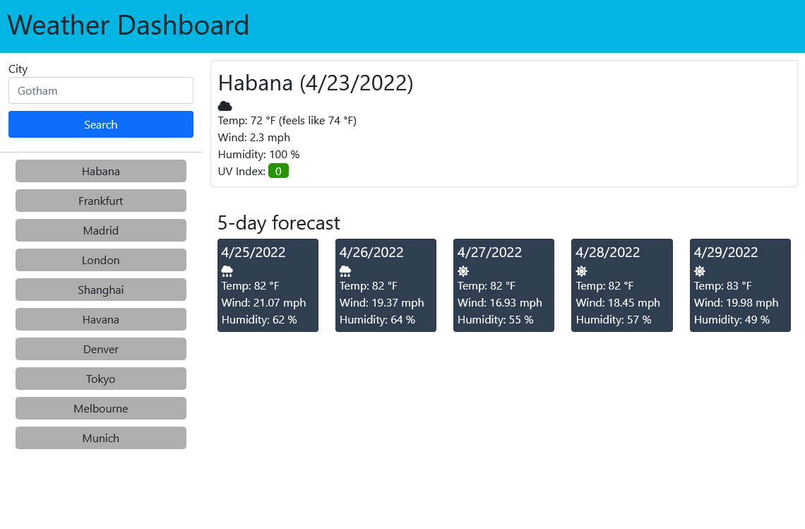

# Weather Dashboard

[Weather app](https://lcortes0801.github.io/weather-dashboard/) that presents weather forecast for mostly any city in the world.

## Getting Started

This is a simple weather app. Use the left pane to search for a city to see the weather forecast for the next 5 days. You can also select a city from the history search shown right below the search button.

### Search History
Search history maximum capacity is set to 10. The search history will always be sorted according to the most recent search and will never contain duplicates.

## Implementation

The page was built mostly with HTML and styled using mainly bootstrap and some custom styles. Query results are dinamically updated on the page using JavaScript and jQuery.

When the document loads, the search history is loaded but no forecast is shown until the user selects a city from the history or searches for a new one.

### Fetch requests
Weather data is fetched from [OpenWeather API](https://openweathermap.org/).

API calls are executed asynchronously through JavaScript Fetch API. When the `Promise` returns, the UI is updated with the data received. If the API call fails, an error message is shown in lieu of the weather forecast.

## Future work
- Change the banner background color depending on the weather conditions and/or time of the day.
- Add the ability to change the units (standard/metric/imperial)
